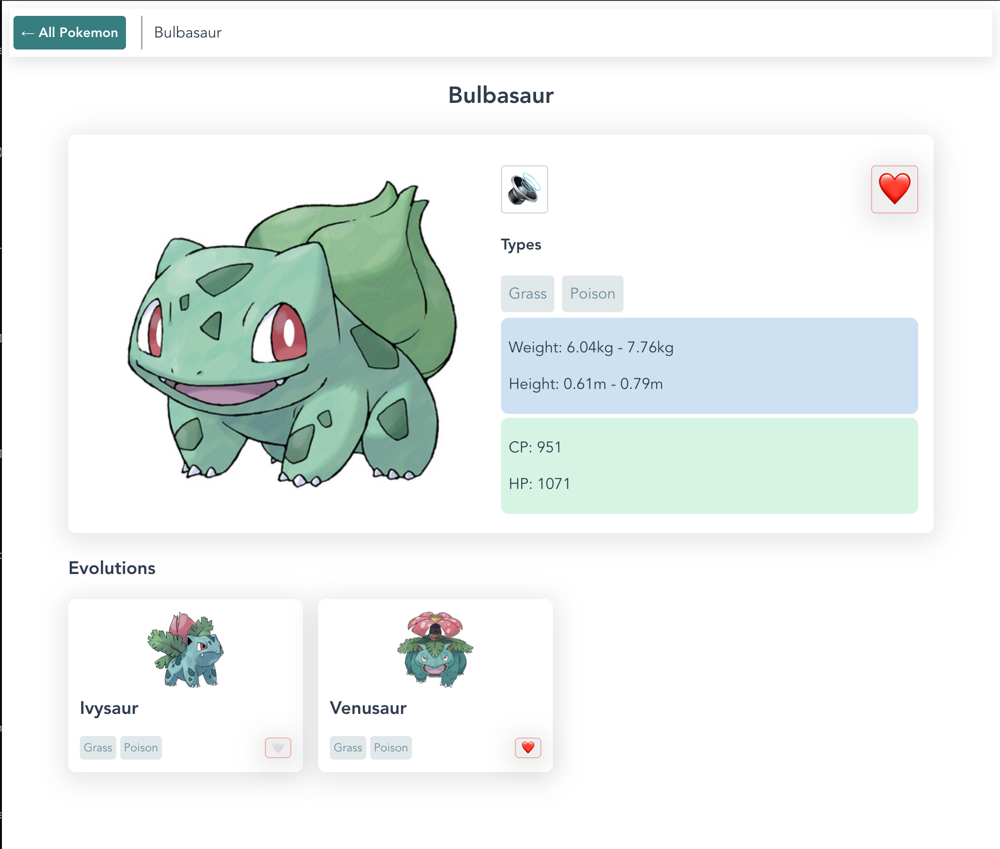

# Frontend coding exercise

The features:

- View all the Pokemon on a list and grid view. Take in count pagination (infinite scroll, simple pagination...)
- Search for Pokemon by text through the use of a search bar.
- Filter Pokemon by type using a dropdown.
- Add and remove a Pokemon to and from your Favorites by clicking the heart icon.
- Switch between `All` Pokemon and `Favorite` Pokemon views.
- View Pokemon details including their evolutions.

# Setup

Clone the repo

`npm install`

`npm run dev`

application will start running on `http://localhost:3000/`

# Tech Stach

Front-end frame work is Vue3 + TypeScript [Vue](https://github.com/vuejs/vue), I have been working with Vue in the past couple of months and i wanted to try out the newest version

Project scafolding with Vite [Vite](https://github.com/vitejs/vite)

|             List View              |             Detail View              |
|:----------------------------------:|:------------------------------------:|
|  |  |

## What I learned 

I have always wanted to use TypeScript, this provides me with an opportunity to play around with it, and i must say its really a developer friend and i will love to use it more in future projects.